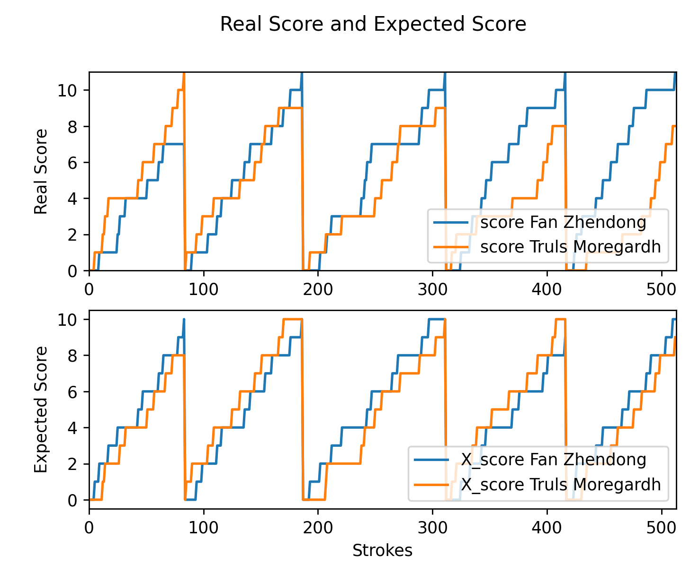
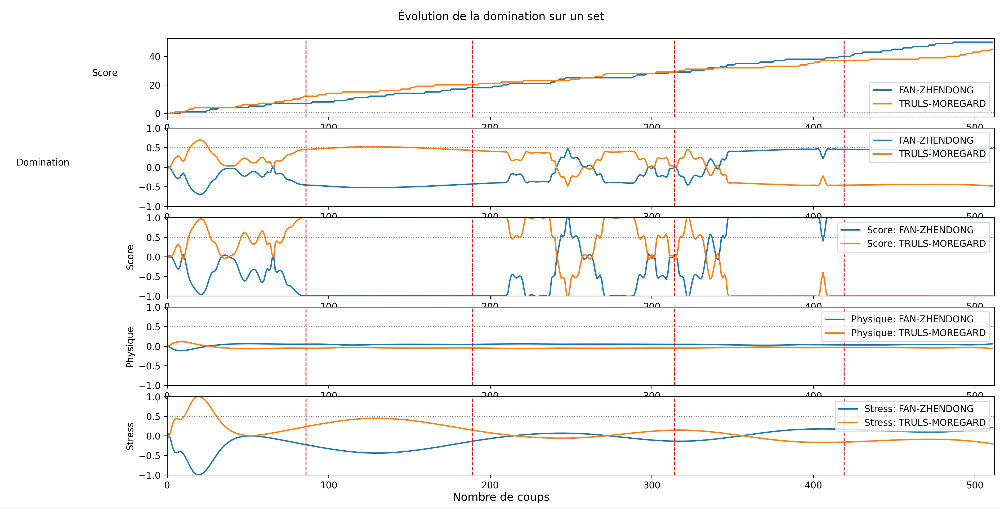

# Table tennis analytics

We propose new metrics to further analyze **table tennis matches**.  Our approach involves adapting existing metrics by incorporating additional attributes provided by the **detailed data**, such as player zones and shot angles. Furthermore, we present a methodology for **visualizing all metrics simultaneously** during a single set, enabling a comprehensive assessment of their significance.

This repository is linked to a publication presented at the _10th Workshop on Machine Learning and Data Mining for Sports Analytics_
 **[MLSA 2023](https://dtai.cs.kuleuven.be/events/MLSA23/)**. You can read the pdf version of the publication **[here](https://hal.science/hal-04240982)**. And reproduce the figures of the publication by executing :

```bash
# Clone the repository
$ git clone https://github.com/centralelyon/table-tennis-analytics.git
$ cd Metrics/Lebrun_Zhendong/
# Run the file MatchAnalysis.py
$ python3 MatchAnalysis.py
```

## Expected score
Expected score is calculated on the history of rallies and their outcomes. It's inspired on the expected goal in soccer.  
Use `Metric/ExpectedScore/Expected_Points.py` to compute and display expected score.

  

## Domination
We created multifactorial dominance based on physical, mental, and factual (with the score) factors.  
Use `Metric/Domination/Calcul_Domination_Match.py` to compute and display domination.

  


## How to cite

If you find this work useful, please consider using the follwing citations:

> Gabin Calmet, Aymeric Erades, Romain Vuillemot. Exploring Table Tennis Analytics: Domination, Expected Score and Shot Diversity. Machine Learning and Data Mining for Sports Analytics, Sep 2023, Turin, Italy.

    @inproceedings{calmet:hal-04240982,
        TITLE = {{Exploring Table Tennis Analytics: Domination, Expected Score and Shot Diversity}},
        AUTHOR = {Calmet, Gabin and Erades, Aymeric and Vuillemot, Romain},
        URL = {https://hal.science/hal-04240982},
        BOOKTITLE = {{Machine Learning and Data Mining for Sports Analytics}},
        ADDRESS = {Turin, Italy},
        EDITOR = {Springer Link},
        SERIES = {Communications in Computer and Information Science},
        YEAR = {2023},
        MONTH = Sep
    }


## Domination

We defined the **domination** as a situation in which a player (or a team) consistently outperforms their opponents and maintains a significant advantage. This function is close to 1 when the first player (or team) dominates, and it is close to -1 if it is the second.

> **Note :** we computed the domination as a function of three parameters : the **score** advantage, the **physical** domination and the **mental** domination.


## Expected Score

The **expected score** is a statistical metric to estimate the probability of winning a point based on various factors such as player skill, shot quality, and opponent performance.

> **Note :** To compute this metric, we used a **Playing Pattern Tree** in order to explore all the possible patterns of a point. We used **Simulated Data** to extend the database and to increase the precision.

## Creativity (or Shots Diversity)

The **creativity** is defined as the variety of shots and techniques employed by a player during a match, including variations in racket side, placement, and shot selection.
> **Note :** To compute the distance between two openings, we look at the depth of their common ancestor in the **Playing Pattern Tree**. 
